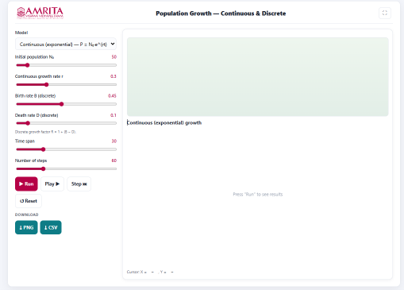
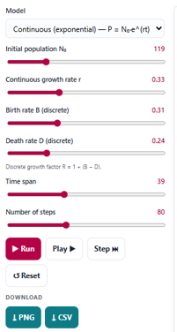
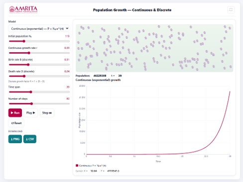

### Procedure

1. The simulator enables users to investigate population growth under both continuous (exponential) and discrete growth models. Users can configure the model parameters, execute the simulation, visualize changes in population size over time, and compare the influence of different growth parameters on population dynamics.

 
&nbsp;

2. The simulator consists of a parameter panel on the left and a visualization panel on the right for displaying the population animation and the corresponding growth curve.

 
&nbsp;

3. Select the desired population growth model from the Model drop-down menu. The simulator provides options for Continuous (Exponential) Growth and Discrete Population Growth models. Select the model appropriate for the analysis.
 
&nbsp;

4. Specify the initial population size (N₀) using the corresponding slider. This parameter defines the number of individuals present in the population at the beginning of the simulation.
 
&nbsp;

5. Adjust the continuous growth rate (r) using the Continuous growth rate slider. This parameter specifies the intrinsic rate of population increase in the continuous exponential growth model.
 
&nbsp;

6. If the discrete growth model is selected, specify the birth rate (B) using the Birth rate slider. This parameter represents the average number of births contributing to population growth during each time interval.
 
&nbsp;

7. Specify the death rate (D) using the Death rate slider. This parameter represents the average mortality occurring during each discrete time interval. The simulator computes the discrete growth factor using the relationship R = 1 + (B − D).
 
&nbsp;

8. Specify the total simulation duration using the Time span slider. This parameter determines the total period over which population growth is simulated.
 
&nbsp;

9. Set the number of computational steps using the Number of steps slider. This parameter determines the temporal resolution of the simulation and the number of points used to generate the population growth curve.
 
&nbsp;

10. After configuring all simulation parameters, click the Run button to execute the simulation. The simulator calculates the population growth trajectory using the selected model and parameter values.
 
&nbsp;

11. Alternatively, click the Play button to visualize the simulation continuously or click the Step button to advance the simulation one time step at a time for detailed observation of the population changes.

 
&nbsp;

12. Observe the animation panel displayed above the graph. The animation provides a visual representation of the simulated population, illustrating changes in the number of individuals throughout the simulation.
 
&nbsp;

13. Examine the simulation statistics displayed above the graph, including the current population size, simulation time (t), and other model information. These values are updated continuously as the simulation progresses.
 
&nbsp;

14. Observe the population growth graph displayed below the animation panel. The graph illustrates the variation in population size (P) with respect to time, based on the selected continuous exponential growth model.
 
&nbsp;

15. Interpret the X-axis (Time) to determine the progression of the simulation and the Y-axis (Population Size) to examine how the population changes throughout the simulation period.
 
&nbsp;

16. Observe the shape of the growth curve. In the continuous exponential growth model, the population increases slowly during the initial stages and subsequently exhibits progressively faster growth as the population size increases, producing the characteristic exponential growth pattern.
 
&nbsp;

17. Use the graph legend to identify the plotted exponential growth curve corresponding to the selected population growth model. Move the cursor over the graph, if required, to display the corresponding coordinate values shown beneath the graph. These values indicate the population size at a specific time point and facilitate detailed examination of the growth trajectory.
 
&nbsp;

18. Modify one or more simulation parameters, such as the initial population size (N₀), continuous growth rate (r), time span, or number of simulation steps, and execute the simulation again to investigate how these parameters influence the exponential growth curve.
 
&nbsp;

19. If required, click the Play button to replay the simulation continuously or click the Step button to advance the simulation one time step at a time for detailed observation of population growth.
 
&nbsp;

20. Click the Reset button, if required, to restore the default simulation parameters before performing another simulation.
 
&nbsp;

21. Download the graphical output by clicking the PNG button or export the numerical simulation data by clicking the CSV button for further analysis and comparison.
 
&nbsp;

22. Repeat the above procedure using different combinations of growth rates, initial population sizes, simulation durations, and growth models to compare the characteristics of continuous and discrete population growth under different ecological conditions.
 
&nbsp;

