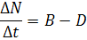
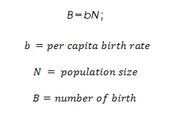
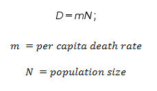
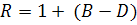
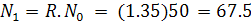
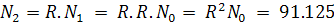
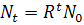
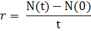
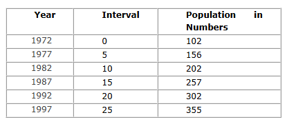
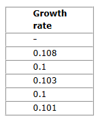

### Exponential Growth:
 
If a population has a constant birth rate through time and is never limited by food or disease, it has what is known as exponential growth. With exponential growth the birth rate alone controls how fast (or slow) the population grows.

&nbsp;

#### What is a population?
 
A population is a collection of interbreeding individuals of the same species that live together in a region. Population ecology is the study of population and how they change over time in relation to the environment including the environmental influences on population density and distribution, age structure and variations in population size. Population size can be constant, increasing or decreasing.

&nbsp;

##### Various factors that affect growth pattern of a population:
 
**Environmental factors:** Every organism requires an optimum condition for its growth and proliferation. Polar bears will not survive if they are exposed to desert conditions.

**Food resources:** Availability of food and water is very important in development of an organism and hence to maintain its healthy body so as to reproduce efficiently.

**Species interactions:** One species may depend on other species for survival. One species might be the food of the other or existence of one species might be mandatory for the other. Two species might share the same food and habitat which eventually leads to competition. In such cases population of one species might depend on that of the other.

**Natural calamity:** An occurrence of a natural calamity will cause a steep decline in the number of organism or might even wipe off the species.

**Human interventions:** Human activities such as poaching, deforestation, pollution caused by nearby human settlements can cause a drastic decrease in the number of species.

&nbsp;

If there is situation, such that none of these factors are present to disturb the growth and proliferation of an organism, then the organism will keep on multiplying. Such a growth pattern of an organism is known as exponential growth. Nearly all populations will tend to grow exponentially as long as the resources are available. This is the simplest type of population growth.

&nbsp;

### Exponential Population Growth Model:

Exponential population growth occurs when a single species is not limited by other species (no predation, parasitism, competition), resources are not limited and environmental conditions are constant. In such conditions, population grows exponentially at constant percentage per time. Such a condition that permits exponential growth of a population is called an ecological vacuum. Ecological vacuum does not often occur in nature for a long period. In nature exponential population growth occurs commonly during a recovery of a population after a large scale disturbance (fire, epidemic. etc).

In an exponential population growth model, the change in population size may be determined by the following factors.
 

Change in population size during a fixed time interval=birth during time interval-deaths during time interval.

 
&nbsp;

#### Birth rate:
Birth rate or natality rate is a measure of the extent to which a population replenishes itself through births.

 
&nbsp;

#### Death rate:

Death rate is the rate at which a population is losing individuals.

 
&nbsp;

#### Exponential population growth models may be classified into:

1. Discrete population growth model.

2. Continuous population growth model.

&nbsp;

#### Discrete Population Growth Model:

An exponential population growth model may be defined as a discrete population growth model if the individuals of a population show:

* Discrete breeding season.
* Overlapping generations or Non overlapping generation.
* Semelparous life history or Iteroparous life history.

In **discrete breeding population** the species may breed only at a specific time usually at a particular time of the year. Breeding seasons introduce some delay in the regulative process. If a species lives for a number of years and produces relatively few young ones each year the delay time of one year due to discrete breeding season is likely to be short compared to the natural period of the species and so any oscillations caused by the delay will be convergent. But if the adults breeding in one season rarely or never survive to breed in the next has an important effect on their dynamics. In discrete growth we consider birth rate and death rate of the organisms.

&nbsp;

In population of **overlapping generation** each generation lives for two periods like youth and old age (two period life versions). At any time period one generation of youth coexist with one generation of elderly. At the beginning of the next period the elderly die off, the youth themselves become elderly and a new generation of elderly is born. Thus there are two overlapping generation of people living at any one time. In non overlapping generation every period a new generation arises and old one dies off. Generation precedes and follows each other but they do not overlap at any point.

&nbsp;

**Semelparity** and **iteroparity** refer to the reproductive strategy of an organism. A species is considered semelparous if it reproduces only a single time before it dies and Iteroparous if it can reproduce more than once in its lifetime.

In population with discrete population growth, the population growth depends on the R (geometric growth factor). Growth factor is the factor by which a quantity multiplies itself over time or fundamental net reproductive rate. Geometric growth factor is obtained from the difference in the number of birth per year and the number of death per year.

 
&nbsp;
Imagine a situation where the government of India starts a sanctuary far from human settlements for protection of tigers (Panthera tigris). There is surplus food available in form of small mammals. Poaching is strictly prohibited. There is no other factor to disturb the intrinsic growth of the population. Mating can occur generally more common between November and April. The gestation period is 16 weeks.

If the population starts with 50 tigers and number of birth per year of the population from which the tigers were obtained was 0.45 and number of death per year was 0.1, then the R value will be 1+(0.45-0.1)=1.35 if so the population at the end of first year, second year, etc can be predicted. At the end of first year there would be:

 
&nbsp;
At the end of second year there would be:

 
&nbsp;
Thus at the end of t years the population will be:

 
&nbsp;

#### Continuous Population Growth:

A population growth model may be defined as continuous population growth model if the individuals of a population show continuous breeding season. They never depend on parameters like season, food, climate for breeding. Here the population depends on instantaneous per capita rate of growth. It is best described in term of rate of population size change.

 Here, r is the instantaneous per capita rate of growth. Here r can be calculated by the following equation:

 

 
&nbsp;

Consider the example of lion-tailed monkey. The Lion-tailed Macaque (Macaca silenus) is an Old World monkey that is endemic to the Western Ghats of South India. The Lion-tailed Macaque primarily eats indigenous fruits, leaves, buds, insects and small vertebrates in virgin forest. These animals are disappearing due to loss of habitat. Gestation is approximately six months. The young are nursed in the first year. Sexual maturity is reached at four years for females, six years for males. The life expectancy in the wild is approximately 20 years.
 
&nbsp;

 

Let us suppose human settlement is withdrawn from a small area in the Western Ghats and the forest begin to grow rapidly, slowly the number of trees, insects and small vertebrates begin to increase. Let us say 102 lion-tailed monkeys find their way into this ideal place of growth and the growth of the lion-tailed monkeys are as follows:

 

 
&nbsp;

Then from the data: the rate of growth = (355-102)/25 = 10.12 = 0.1012.

 

Since the growth is between 0 and 1 make the data into decimal value by dividing by 100.

Growth affects how common or rare a species is, which in turn affect the rate of population harvest. Like, how many fishes will be there after a period of trawling? How many trees can be cut from the population ensuring the same growth of the tree population? It is also important to protect the now endangered species. This can be easily done if we know growth rate of these species and protect them. This is especially useful in expanding the population. Thus though continuous or discrete mode of population growth is a very rare event it has its own importance in predicting the behavior of a population.

 

Calculate the growth using the equation and make it to decimals to run in the simulator;

 

 
&nbsp;

 
&nbsp;
